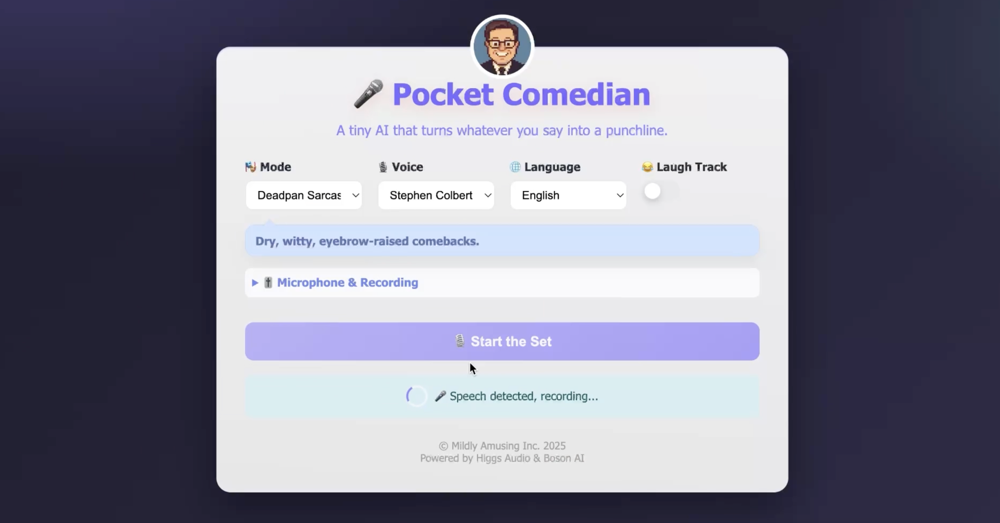

# Pocket Comedian (Flask)


An AI pocket comedian you can talk to. Speak into your mic, get a playful response performed back to you in real time. Runs as a Flask server with Socket.IO streaming and a simple, polished web UI.

[]([https://github.com/<user>/<repo>/blob/main/video.mp4](https://drive.google.com/file/d/1FWibTVeMTMgai_1hUfri3QuNI1jqWVsz/view?usp=drive_link))

## Quick Start

1) Python environment
- Python 3.10+ recommended
- Create and activate a virtualenv

2) Install dependencies
```
pip install -r requirements.txt
```

3) Configure environment
- Create a `.env` file in the project root and add your Boson API key:
```
BOSON_API_KEY=your_boson_api_key_here
```

4) Run the server
```
python flask_app.py
```
Open your browser to http://localhost:5001

## Features
- Talk-in, joke-out: speak and hear a witty comeback in seconds
- Smooth, live playback — responses stream with minimal gaps
- Toggle a laugh track for instant club vibes
- Pick a mic and a voice (even clone your own for fun)
- Conversation mode remembers context for better banter

## Modes
- Anger Translator — short, spicy rants; loud, fast, funny
- Deadpan Sarcasm — dry, witty comebacks
- Roast — playful burns with sharp punchlines
- Conversation — friendly, quick‑witted banter (multi‑turn)

## Notes
- Your browser will ask for microphone permission the first time
- If PyAudio install fails, see PortAudio notes online for your OS
